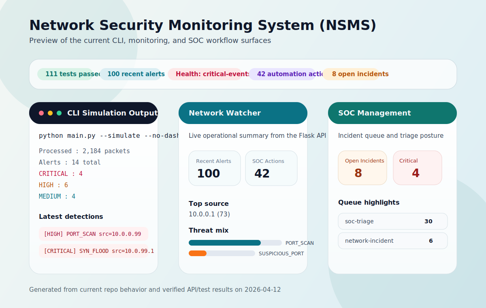

# Network Security Monitor


Network Security Monitor is a Python-based Network Security Monitoring (NSM) project that captures or simulates traffic, detects suspicious behavior, and surfaces alerts through CLI, log, and lightweight web interfaces.

Project vision: evolve this into `SentinelNet`, a fuller NSMS platform with SOC workflows, incident response, and OT-aware monitoring.

---

## What It Does

- Monitors traffic in live capture mode or replay-style simulation mode
- Detects common threat patterns such as port scans, SYN floods, brute force attempts, DDoS bursts, DNS tunneling, phishing indicators, suspicious ports, data exfiltration, and traffic anomalies
- Stores and forwards alerts through log files, webhooks, Slack, email, and SIEM-style JSONL output
- Supports SOC-style automation with case logging and action cooldowns
- Exposes a minimal Flask/Vercel API for dashboards, alert summaries, and incident views

---

## Current Focus

The strongest near-term product direction for this repo is:

- Primary user: SMB IT admin or small SOC team
- Primary promise: detect suspicious network activity quickly and make triage understandable
- Primary success metric: a new user can install the project, run a simulation, and inspect meaningful alerts within a few minutes

---

## Preview



---

## Quick Start

Install dependencies:

```bash
pip install -r requirements.txt
```

Run the simulator without the dashboard:

```bash
python main.py --simulate --no-dashboard
```

Run the simulator with the real-time dashboard:

```bash
python main.py --simulate
```

View previously generated alerts:

```bash
python main.py --show-alerts alerts.log
```

---

## First Five Minutes

If you want the fastest path to seeing value from the project:

1. Install dependencies with `pip install -r requirements.txt`
2. Run `python main.py --simulate --no-dashboard`
3. Inspect `alerts.log`, `soc_actions.log`, and `incidents.db`
4. Run `python main.py --simulate` to see the real-time dashboard output
5. Review profiles in `config_profiles.json` and rerun with `--profile office_tuned`

For current product execution priorities, see `docs/WEEK1_EXECUTION_PLAN.md`.

---

## Runtime Modes

### Simulation

Best for demos, testing, and local development. No raw socket privileges required.

```bash
python main.py --simulate
python main.py --simulate --no-dashboard
python main.py --simulate --profile office_tuned --save-tuning tuning.json
```

### Live Capture

Best for real monitoring on a host with packet capture privileges.

```bash
python main.py --list-interfaces
sudo python main.py --live
sudo python main.py --live --interface eth0
python main.py --live --interface eth0 --live-duration 1800
```

### API / Dashboard

The repository includes a Flask-based entrypoint for lightweight API and dashboard views, including Vercel-compatible serverless deployment for read-only monitoring surfaces.

Available routes:

- `GET /`
- `GET /health`
- `GET /dashboard`
- `GET /network-watcher`
- `GET /soc-management`
- `GET /api/alerts`
- `GET /api/network-watcher`
- `GET /api/soc-summary`
- `GET /api/incidents`
- `GET /api/incidents/<incident_id>`
- `PATCH /api/incidents/<incident_id>`

Note: live packet capture is not available in Vercel's serverless runtime. Use a VM, container, or host with raw network access for `--live`.

When `NSM_ALERTS_DATA_FILE` is configured, the API prefers structured alert JSONL records over parsing `alerts.log`.

---

## Sample API Responses

Example payload from `GET /api/alerts`:

```json
{
  "count": 2,
  "alerts": [
    {
      "timestamp": "2026-04-03 00:07:53",
      "severity": "HIGH",
      "threat_type": "PORT_SCAN",
      "src_ip": "10.0.0.1",
      "raw": "2026-04-03 00:07:53,016 ERROR [2026-04-03 00:07:53] [HIGH] [PORT_SCAN] src=10.0.0.1 Test alert"
    },
    {
      "timestamp": "2026-04-03 00:07:54",
      "severity": "CRITICAL",
      "threat_type": "SYN_FLOOD",
      "src_ip": "10.0.99.1",
      "raw": "2026-04-03 00:07:54,123 ERROR [2026-04-03 00:07:54] [CRITICAL] [SYN_FLOOD] src=10.0.99.1 SYN flood detected"
    }
  ]
}
```

Example payload from `GET /api/incidents`:

```json
{
  "count": 2,
  "incidents": [
    {
      "incident_id": "INC-95CB7B941FA4",
      "created_at": 1775344876.2230377,
      "status": "open",
      "queue": "soc-triage",
      "severity": "HIGH",
      "threat_type": "PORT_SCAN",
      "src_ip": "1.1.1.1",
      "dst_ip": "2.2.2.2",
      "dst_port": null,
      "description": "Port scan detected: 10 distinct ports contacted within 30s",
      "metadata": {
        "distinct_ports": 10,
        "sample_ports": [1, 2, 3, 4, 5, 6, 7, 8, 9, 10]
      }
    },
    {
      "incident_id": "INC-6B877347D08D",
      "created_at": 1775344876.3023574,
      "status": "open",
      "queue": "network-incident",
      "severity": "CRITICAL",
      "threat_type": "SYN_FLOOD",
      "src_ip": "1.1.1.1",
      "dst_ip": "2.2.2.2",
      "dst_port": 80,
      "description": "SYN flood: 10 SYN packets in 5.0s",
      "metadata": {
        "syn_count": 10
      }
    }
  ]
}
```

Example filtering request:

```text
GET /api/incidents?status=open&queue=soc-triage&limit=10
```

Example update request to `PATCH /api/incidents/<incident_id>`:

```json
{
  "status": "assigned",
  "assignee": "alice",
  "metadata": {
    "ticket_id": "SOC-9"
  }
}
```

These examples are representative of the current API shapes in `api/index.py` and help show what downstream integrations can expect.

---

## Detection Coverage

| Threat Type | Detection Method |
|---|---|
| **Port Scan** | Single source IP contacting many distinct ports within a time window |
| **SYN Flood** | High rate of TCP SYN packets from one source |
| **Brute Force** | Repeated connection attempts to authentication ports such as SSH, RDP, and FTP |
| **DDoS** | Very high packet rate from a single source IP |
| **DNS Tunneling** | Oversized or repeated suspicious DNS query payloads |
| **Suspicious Port** | Connections to known backdoor or C2-associated ports |
| **Malicious IP** | Traffic to or from threat-intelligence-listed IPs |
| **Phishing Attempt** | IOC or domain match in DNS/HTTP/HTTPS content |
| **Data Exfiltration** | High outbound byte volume in a short window |
| **Unusual Traffic** | Packet-rate spike versus a rolling baseline |

SOC automation features:

- Playbook-based response actions for alerts
- JSONL audit trail in `soc_actions.log`
- Incident case persistence in `incidents.db`
- Cooldown handling to reduce duplicate automation noise

---

## Architecture

At a high level, the project follows a simple monitoring pipeline:

1. `packet_analyzer.py` normalizes raw packets into internal `Packet` models
2. `monitor.py` coordinates packet flow, runtime state, and alert handling
3. `threat_detector.py` applies detection logic across the supported threat types
4. `alert_manager.py` stores alerts and forwards them to logs and integrations
5. `soc_automation.py` and `incident_manager.py` add response tracking and case persistence
6. `dashboard.py` and `api/index.py` expose human-friendly views of the results

This keeps packet parsing, detection, alerting, response, and presentation separated enough to test each layer independently.

---

## Project Structure

```text
network_security_monitor/
├── __init__.py
├── alert_manager.py
├── config.py
├── dashboard.py
├── incident_manager.py
├── models.py
├── monitor.py
├── packet_analyzer.py
├── soc_automation.py
└── threat_detector.py

api/
└── index.py

deploy/
├── systemd/
│   ├── install.sh
│   └── nsm.service
└── windows/
    ├── install_task.ps1
    └── run_nsm.ps1

docs/
├── SENTINELNET_PRD.md
├── SENTINELNET_ROADMAP.md
└── WEEK1_EXECUTION_PLAN.md

tests/
├── test_alert_manager.py
├── test_api.py
├── test_config.py
├── test_dashboard.py
├── test_incident_manager.py
├── test_models.py
├── test_monitor.py
├── test_packet_analyzer.py
├── test_soc_automation.py
└── test_threat_detector.py

main.py
requirements.txt
RUNBOOK.md
config_profiles.json
```

---

## Configuration

Primary settings live in `network_security_monitor/config.py`.

Common tunables include:

```python
Config.PORT_SCAN_THRESHOLD = 25
Config.SYN_FLOOD_THRESHOLD = 200
Config.BRUTE_FORCE_THRESHOLD = 12
Config.DDOS_THRESHOLD = 1500
Config.DNS_QUERY_SIZE_THRESHOLD = 700
Config.DATA_EXFIL_THRESHOLD_BYTES = 50 * 1024 * 1024
Config.TRAFFIC_ANOMALY_MULTIPLIER = 3.5
Config.SIEM_OUTPUT_FILE = "siem/alerts.jsonl"
Config.ALERT_WEBHOOK_URL = "https://example.local/hook"
```

Environment variable overrides:

- `NSM_ALERT_WEBHOOK_URL`
- `NSM_SLACK_WEBHOOK_URL`
- `NSM_SMTP_HOST`
- `NSM_SMTP_PORT`
- `NSM_SMTP_USERNAME`
- `NSM_SMTP_PASSWORD`
- `NSM_ALERT_EMAIL_FROM`
- `NSM_ALERT_EMAIL_TO`
- `NSM_SIEM_OUTPUT_FILE`
- `NSM_ALERTS_DATA_FILE`
- `NSM_PORT_SCAN_TRUSTED_SOURCES`
- `NSM_SOC_AUTOMATION_ENABLED`
- `NSM_SOC_AUTOMATION_MIN_SEVERITY`
- `NSM_SOC_AUTOMATION_COOLDOWN_SECONDS`
- `NSM_SOC_AUTOMATION_LOG_FILE`
- `NSM_INCIDENTS_LOG_FILE`
- `NSM_SOC_AUTOMATION_AUTO_CONTAIN_CRITICAL`

Local `.env` values are auto-loaded by `Config` when present.

---

## Profiles And Tuning

Bundled baseline profiles:

- `dev`
- `office`
- `office_tuned`
- `datacenter`
- `home_lab`
- `corp_wifi`
- `server_vlan`

Examples:

```bash
python main.py --simulate --profile office
python main.py --simulate --profile office_tuned
python main.py --live --profile datacenter --profile-file config_profiles.json
python main.py --live --profile office --live-duration 1800 --save-tuning tuning.json
```

After simulation or live runs, the tool prints:

- Integration readiness for Slack, webhook, email, and SIEM outputs
- Tuning guidance based on observed alert volume

---

## Integrations

Fast integration examples:

```bash
python main.py --simulate --no-dashboard \
  --slack-webhook-url https://hooks.slack.com/services/XXX/YYY/ZZZ \
  --notify-min-severity HIGH

python main.py --simulate --no-dashboard \
  --siem-output-file siem/alerts.jsonl
```

Slack validation example:

```bash
set NSM_SLACK_WEBHOOK_URL=https://hooks.slack.com/services/XXX/YYY/ZZZ
python main.py --simulate --no-dashboard
```

Deployment and operations assets:

- `.env.example`
- `RUNBOOK.md`
- `deploy/systemd/nsm.service`
- `deploy/systemd/install.sh`
- `deploy/windows/install_task.ps1`
- `deploy/windows/run_nsm.ps1`

---

## Testing

Run the test suite with:

```bash
pytest tests/ -v
```

On Windows with the project virtual environment:

```powershell
.\.venv\Scripts\python.exe -m pytest tests\ -v
```

Current verified result in this repository:

- `117 passed`

---

## Roadmap

Near-term project direction for `SentinelNet`:

- Complete persistent storage beyond log-backed files for alerts and incidents
- Expand SOC operations with assignment, lifecycle states, and KPI/SLA tracking
- Add asset and network context such as inventory, topology, and per-segment baselines
- Integrate threat intelligence enrichment sources and IOC management
- Introduce OT-focused visibility starting with protocol-aware detections
- Explore multi-tenant controls for MSP-style operation

For the full phased plan, see `docs/SENTINELNET_ROADMAP.md`.

---

## Contributing

Contributions are welcome, especially in these areas:

- Detection quality improvements and false-positive tuning
- Additional integrations, dashboards, and deployment hardening
- Test coverage for new detectors, API routes, and SOC workflows
- Documentation, runbooks, and sample datasets for demos

Suggested local workflow:

1. Create or activate the project virtual environment
2. Install dependencies from `requirements.txt`
3. Run `.\.venv\Scripts\python.exe -m pytest tests\ -v` on Windows, or `pytest tests/ -v` elsewhere
4. Validate your change in simulation mode with `python main.py --simulate --no-dashboard`

Keep changes focused, preserve existing behavior unless the change is intentional, and add tests when detector or workflow logic changes.

---

## Product Docs

- `docs/SENTINELNET_PRD.md`
- `docs/SENTINELNET_ROADMAP.md`
- `docs/WEEK1_EXECUTION_PLAN.md`
- `RUNBOOK.md`
- `DRILL_NOTES.md`
